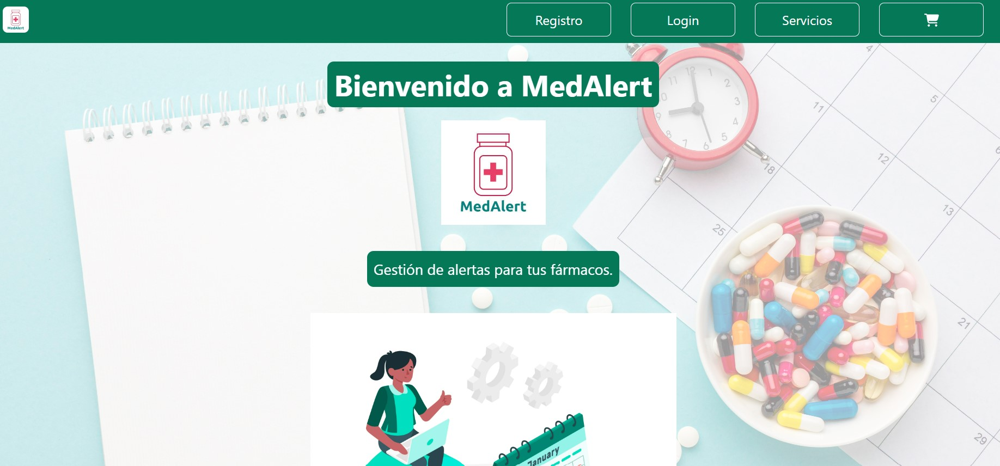
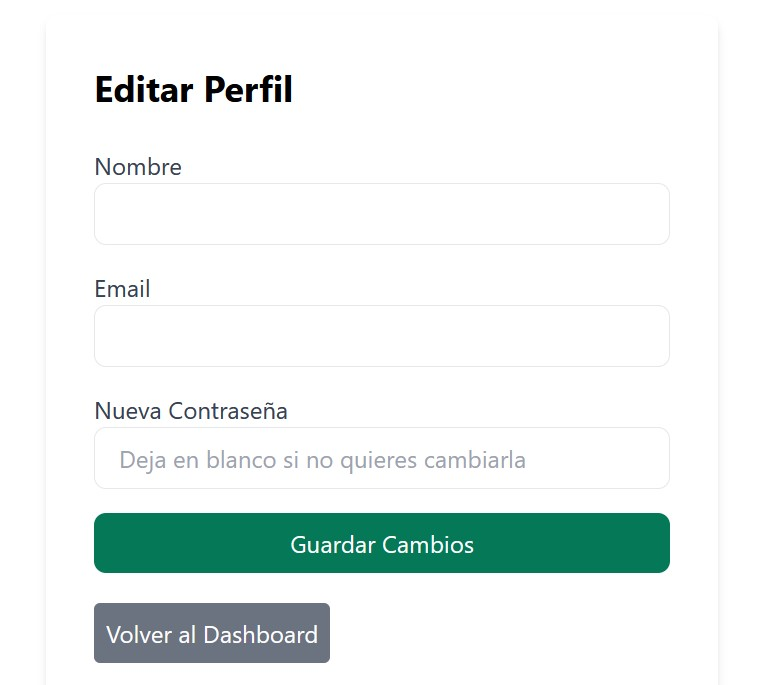
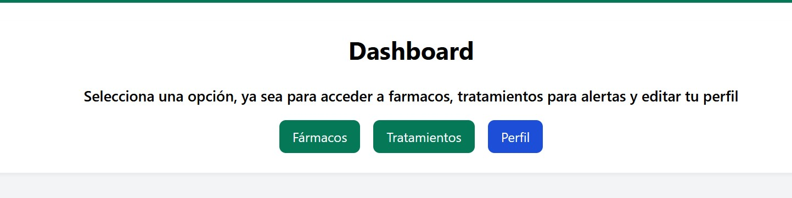

# Módulo 7 - Proyecto 7
## ¡Bienvenidos al proyecto "Aplicación Web E-Commerce MedAlert"!

## Tabla de Contenidos
* [1. Desafío](#1-Desafío)
* [2. Desarrollo de proyecto](#2-Desarrollo-de-proyecto)
* [3. Conclusiones](#3-Conclusiones)

****
## Desarrollo

### 1. Desafio
 Para este último proyecto se solicita crear una aplicación web E-Commerce que permita lo siguiente:
 -Un catálogo de productos/servicios que permita a los usuarios explorar los artículo/servicios disponibles.
- Un carrito de compras para que los usuarios puedan seleccionar y gestionar sus compras.
- Una pasarela de pago segura (específicamente Stripe, PayPal o MercadoPago, en versión de pruebas) que facilite las transacciones en línea.
- Autenticación de usuarios, incluido el registro de cuentas y el inicio de sesión, mediante JSON Web Tokens (JWT).
- Autorización, mediante la creación de áreas privadas en las que los usuarios puedan acceder y gestionar su perfil e información personal.

  ****

### 2. Desarrollo de proyecto
 La idea principal del proyecto es sobre una aplicación web (FullStack MERN) que permita gestionar fármacos, listas de tratamientos y generar alertas como recordatorios para dar seguimientos a los tratamientos. Esto nace de la problemática que a veces pasan las personas o familias en general en donde uno o varios integrantes pueden estar con diferentes tratamientos famacológicos a la vez, con el fin de evitar enredos o confusiones de horarios, o duración de tratamiento, asi como dosis entre otras variables se dió con esta aplicación web que permitirá a los usuarios registrar farmacos, y crear trataamientos asociados a estos farmacos (uno o más en un array) y categorizarlos por tratamientos, para finalmente poder crear alertas de recordatorios via mail, en una primera fase, de esta forma podrán acceder a la información que necesiten, asi como establecer duración de los tratamientos o el objetivo de un fármaco entre otros. Adicionalmente se construye la generación de Token por medio de "SignIn" con el fin de poder autenticarse para acceder a la información de usuarios en específico.
 Para el análisis del proyecto, se parte desde la estructura base por Backend, defiendo los controladores, modelos y rutas. En donde:
  - Modelos está compuesto por estructuras de usuarios, farmacos y listas (que corresponden a los tratamientos que ingresarán los clientes.
  - Controladores, contiene autenticación, farmaco, listas y usuarios.
  - Rutas, desde index para gestionar las rutas de usuario, lista, farmaco y autenticación.
  - Se selecciona como pasarela de pago Paypal para este proyecto.
  - Base Datos utilizada MongoDB (Atlas).
  -  Adicionalmente se considera en Frontend Vite y TailwindCSS.
  - 
    A continuación se muestran extractos del proyecto final, desde diferentes elementos/componentes:

     - Home.
      
      
    
    - Registro de cuenta.
      
      
      
    - Login, para inicio de sesión.
      
      

    - Perfil del usuario.
    
     
    
    - Dashboard para acceso a Fármacos y Tratamientos, en donde:
      
      
      
    - Desde Fármacos, el usuario podrá registrar los fármacos que necesite, a su vez poder editar o eliminar.
        
      

      
      
      

     - Desde Tratamiento, el usuario podrá crear listas de tratamientos para asociarlos con fármacos y posterior a su creación podrá crear la alerta para recordatorio vía mail.
      
      
      
      
            
    - Servicios:
      - Básico - Gratis por un mes.
      - Pro - Ilimitado pago mensual.
      
      
      
    - Y Carro de compras, asociado a pasarela de pago con Paypal.

      
      

      Y por último la estructura y ejemplos de MongoDB:

    - Usuarios:

      

     - Fármacos:

      
    
     - Listas:

              
      

      

  ### 3. Conclusiones
 Para la preparación del proyecto de "MedAlert", se analizaron diferentes variables con el fin de hacer un proyecto interesante a nivel comercial y a su vez que su objetivo ayude a la población debido a potenciales errores en los manejor farmacológicos que se presenta en la actualidad. Luego de varias revisiones y diferentes ideas con ejecuciones de pruebas, se llegó a la idea de crear esta forma de alertas de gestión de fármacos y dar la opción de agrupar por listas, de esta forma si en una persona y/o familia están bajo diferentes tratamientos médicos, se pueda llevar un registro ordenado de los fármacos, y generar alertas por tratamientos.
 Se presentaron varios desafíos durante la creación del código, además de comunicar tanto backend como frontend y pero gracias a reiteradas pruebas, se logró dar con las funcionalidades precisas para que se pudiese ejecutar el código.
 
  ****
*¡Gracias!*
